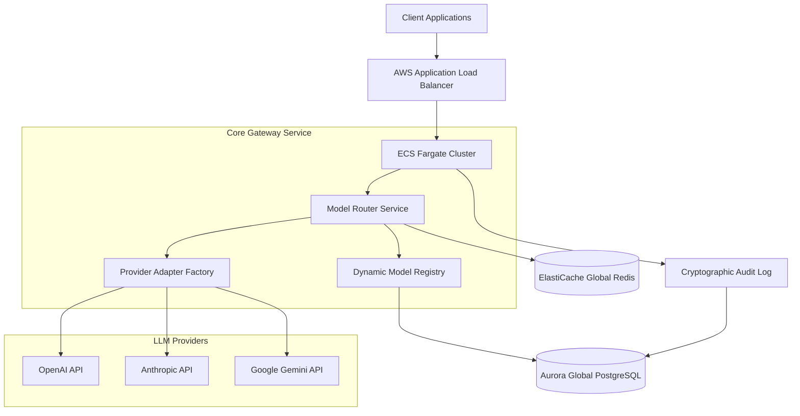

# AI Infrastructure: Multi-Model LLM Gateway

[](https://opensource.org/licenses/MIT)
[](https://fastapi.tiangolo.com)
[](https://aws.amazon.com)

A high-performance, **production-grade LLM orchestration gateway** designed for enterprise scale. It provides a unified, resilient, and secure interface to multiple Large Language Model providers (OpenAI, Anthropic, Gemini, etc.), enabling dynamic routing, cost observability, and cryptographic compliance.

---

## 🏗️ System Architecture

The gateway is built on a "Clean Architecture" pattern, ensuring decoupling between providers and core routing logic.



---

## 🚀 Key Capabilities

### 1. Unified Multi-Model API
- **Single Interface**: Switch between GPT-4o, Claude 3.5, and Gemini Pro 1.5 without changing client code.
- **Provider Adapters**: Standardized payload normalization across all supported providers.

### 2. Intelligent & Resilient Routing
- **Dynamic Registry**: Update model priorities and availability in real-time without restarts.
- **Circuit Breaking**: Automatically bypasses failing providers to ensure 99.9% availability.
- **Fallback Chains**: Cascading logic (e.g., if GPT-4o is down, use Claude-3.5-Sonnet, then Gemini-1.5-Pro).

### 3. Enterprise Security & Compliance
- **Cryptographic Audit Trail**: Every configuration change and sensitive request is logged with **SHA-256 chaining**, making logs tamper-evident.
- **PII Redaction**: Built-in middleware automatically masks sensitive data (emails, keys, etc.) before logging.
- **Data Residency**: Regional controls to ensure requests are routed according to GDPR/HIPAA requirements.

### 4. Real-Time Cost Observability
- **Spend Tracking**: Sub-millisecond tracking of token counts and calculated costs using Redis counters.
- **Budget Enforcement**: Organization-level circuit breakers that cut traffic when budget limits are hit.
- **Observability**: Integrated Prometheus metrics and Grafana dashboards for cost analysis.

### 5. Multi-Region Global Availability
- **Cloud Infrastructure**: Native Terraform modules for active-active AWS deployment across `us-east-1` and `eu-west-1`.
- **Global Data Store**: Synced configuration and rate-limiting across regions.

---

## 🛠️ Technology Stack

| Layer | Technology |
| :--- | :--- |
| **Framework** | FastAPI (Async Python 3.10+) |
| **Database** | Aurora PostgreSQL / SQLite (Portable Mode) |
| **Cache** | Redis (ElastiCache) / In-Memory (Portable Mode) |
| **Infrastructure** | Terraform, AWS ECS Fargate, IAM, KMS |
| **Observability** | Prometheus, Grafana, CloudWatch |
| **Security** | Bcrypt, AES-256GCM, HMAC SHA-256 |

---

## 📦 Getting Started

### Portable Mode (Zero Dependencies)
Ideal for local development or lightweight edge deployments.
```bash
# Clone the repository
git clone https://github.com/your-org/llm-gateway.git
cd llm-gateway

# Setup environment
python -m venv .venv
source .venv/bin/activate
pip install -r requirements.txt

# Seed the local SQLite database
python scripts/seed-sqlite.py

# Launch the gateway
uvicorn app.main:app --reload
```

### Production Deployment (AWS)
Use the included Terraform modules for a full enterprise setup.
```bash
cd infrastructure/terraform/aws
terraform init
terraform plan
terraform apply
```

---

## 📖 Documentation
- [API Reference](file:///d:/Backend%20Engineering/Projects/AI%20Infrastructure%20Multi-Model%20LLM%20Gateway/docs/API_REFERENCE.md)
- [Production Runbooks](file:///d:/Backend%20Engineering/Projects/AI%20Infrastructure%20Multi-Model%20LLM%20Gateway/docs/RUNBOOKS.md)
- [SDK Guide (Python)](file:///d:/Backend%20Engineering/Projects/AI%20Infrastructure%20Multi-Model%20LLM%20Gateway/sdk/python/llm_gateway/client.py)

---

## 📄 License
Released under the [MIT License](LICENSE).
